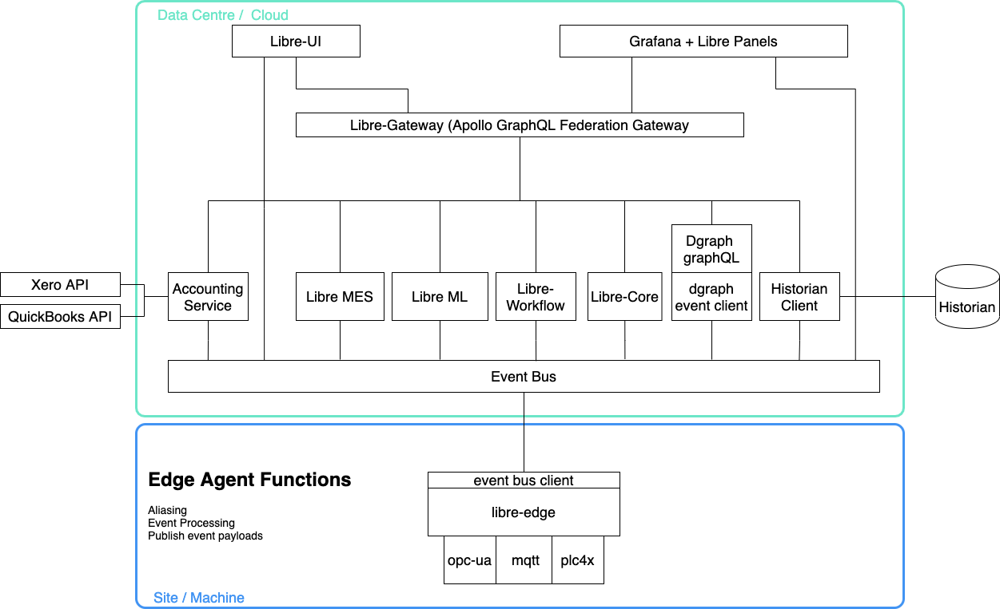

# Libre Common Library
> Libre Manufacturing Data Platform common functions
.
The Common Library provides the following functions for various Libre Microservices:
* Equipment Cache
* Equipment Finder
* LibreDataStoreGraphQL
* Managed Equipment
* PLC Connector
* TagChangeEventHandlers
* ValueChangeFilter
* Event Definition Evaluator
* Event Definition Distributor
* Calendar Service

The Common Library provides the following connectors
* Edge Connector MQTT
* Libre Connector MQTT
* Libre Historian Connector InfluxDB
* PLC Connector MQTT
* PLC Connector OPCUA

## What is the Libre Manufacturing Data Platform?

Libre is an Open-source, Data Science ready continuous improvement and Manufacturing Execution Platform.

The Libre platform allows you to:
* connect to your Manufacturing data sources 
* model your equipment, and the data that your equipment provides
* store machine data in a specialised time-series database with full context from your equipment model
* Define rules for capturing event data from your equipment, and store that event data in the time-series database with context
* Define Materials and recipes that describe the way products are manufactured in your plant
* Access all of your data through an open GraphQL API including the equipment and material models along with data from the time-series database

### Libre Platform Architecture:

The Libre Platform is an Event-Driven Micro-services architecture written in Go.

The Frontend UI application communicates primarily through the GraphQL gateway, and 
receives event notifications directly from the event bus.

Apollo Federation is used to compose a single GraphQL schema from multiple graphql services

Non time-series data is stored in Dgraph which is a GraphQL native database platform.

## Developing

Prereqisites:

-  golang >= 1.16.x

## Contributing

For any issue, there are fundamentally three ways an individual can contribute:

- By opening the issue for discussion: For instance, if you believe that you have uncovered a bug in libre-common, creating a new issue in the [GitHub issue tracker](https://github.com/Spruik/libre-common/issues) is the way to report it.
- By helping to triage the issue: This can be done either by providing supporting details (a test case that demonstrates a bug), or providing suggestions on how to address the issue.
- By helping to resolve the issue: Typically, this is done either in the form of demonstrating that the issue reported is not a problem after all, or more often, by opening a Pull Request that changes some bit of something in the simulator in a concrete and reviewable manner.